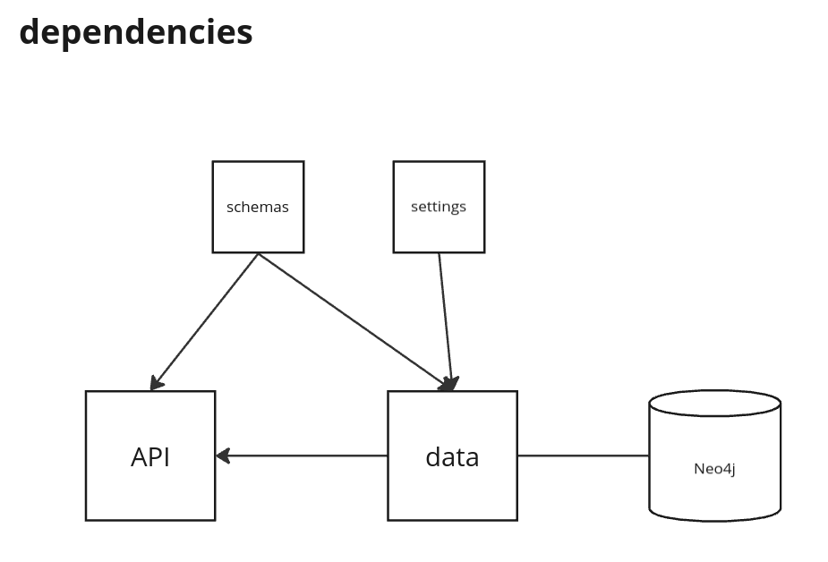

# FastApiAndNeo4J

## Run the application

My docker compose commands are for the compose plugin of Docker (aka docker compose v2).   
If you are using the docker-compose binary instead, replace "docker compose" with "docker-compose".

> docker compose up

Access the API at [http://localhost:8000](http://localhost:8000).  
Start by running the GET /reset endpoint to fill up the DB.
The rest of the endpoint should be self-explanatory.

You can check the content of the DB with the browser at [http://localhost:7474/browser/](http://localhost:7474/browser/).  
There is no authentication needed to connect.

## Run the unit and integration tests locally

Start the Neo4j db with:
> docker compose up neo-db

Set up your local poetry environment, and install all the dependencies, including the dev dependencies with:  
> poetry install --with dev

To run the tests, you need to pass the neo4j URI as an environment variable.  
This will be convenient with a CI/CD pipeline as it allows to parameterize where the database is accessible.  
Add a .env file at the root of the project, with the line `NEO4J_URI=neo4j://localhost:7687`  
Then run
> pytest --cov=app  

The console outputs the result of the tests and the coverage of the source code (which is at 99%). 

Note that the idempotency tests for kinship and friendship are failing, and it's normal.  
I kept them in as a way to show how you can add tests as a definition of an upgrade of the business rules (no duplication of friendships for example).

## Architecture of the repo

The application layer is separated from the data layer to accomplish low coupling: this allows for a more modular application, where the API could pull from several data connector, or where we could change the type of database without breaking the API.
The API can import from the data connector.  
The data connector CANNOT import from the API to avoid any circular import.  
Any shared dependency, must live outside the API or data module, to allow potential reusability (and avoid circular import).  
As an improvement of this architecture, an interface to the data layer could be created, this would ease any change in the data storage technology even more.

The API endpoint are prefixed and stored in a v0 module to ease versioning of the API in the future.  
If a new version of the API is created, we can have the v0 supported for a while as tagged for deprecation. From my experience this is more manageable than having the v0 and v1 code in the same module.

## More static quality with pre-commits

If you work on this projects code, make sure to setup the pre-commits by running  
> pre-commit install  

This will enforce formatting rules and respects of typing best practices before a commit is allowed.

## Improvement ideas
- Singleton for driver: only one driver should be generated for the whole application, as recommended [here](https://neo4j.com/developer-blog/neo4j-driver-best-practices/#:~:text=Create%20One%20Driver%20Instance%20Once%20and%20Hold%20Onto%C2%A0It)
- Authentication for DB
- Authentication for API
- Assess use of [AsyncGraphDatabase](https://neo4j.com/docs/api/python-driver/current/async_api.html#)
- Relationships and parameter constraints for the database
  - Unicity of full name
  - Rule to prevent weird parenting? (like self parenting). Can that be done at the DB relationship level?
  - Unicity of A-PARENT->B 
  - Unicity of A-ARE_FRIENDS->B
- CI/CD pipeline
  - precommit and code_analysis: mypy, black, dependency check
  - build: docker image for app
  - tests: spawn app and db, run all tests
  - quality gate: test coverage report and block if too low
- Perf monitoring (error rate, latency p50, p95)
- Scale up
  - Run tests with 1000* More data in DB
  - Load testing: what if I run 1000 queries in parallel
  - Pagination of results for all 'people' results
